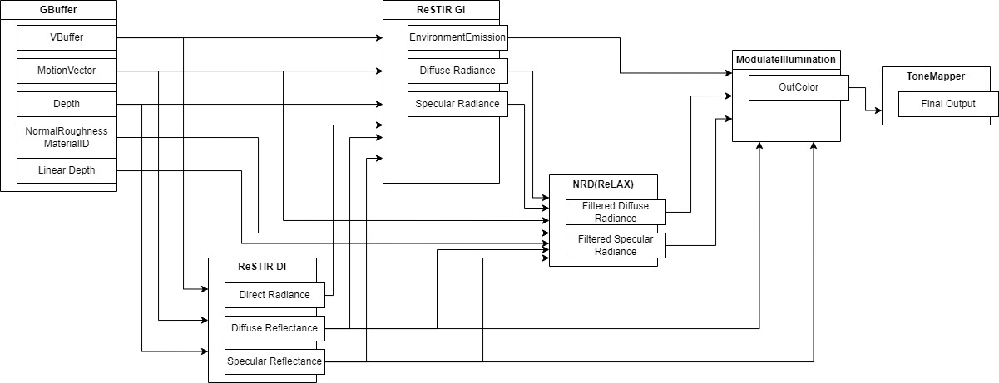
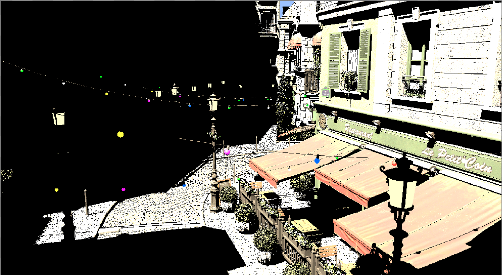
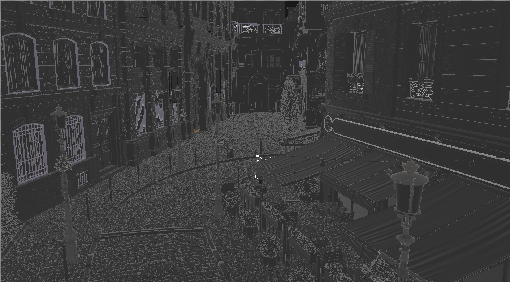
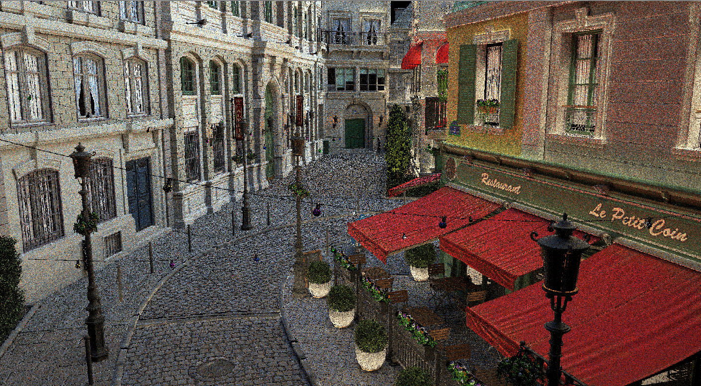
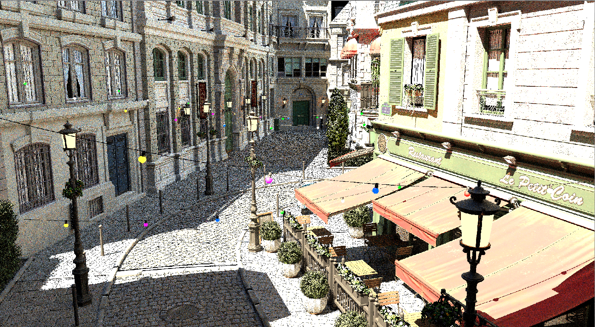
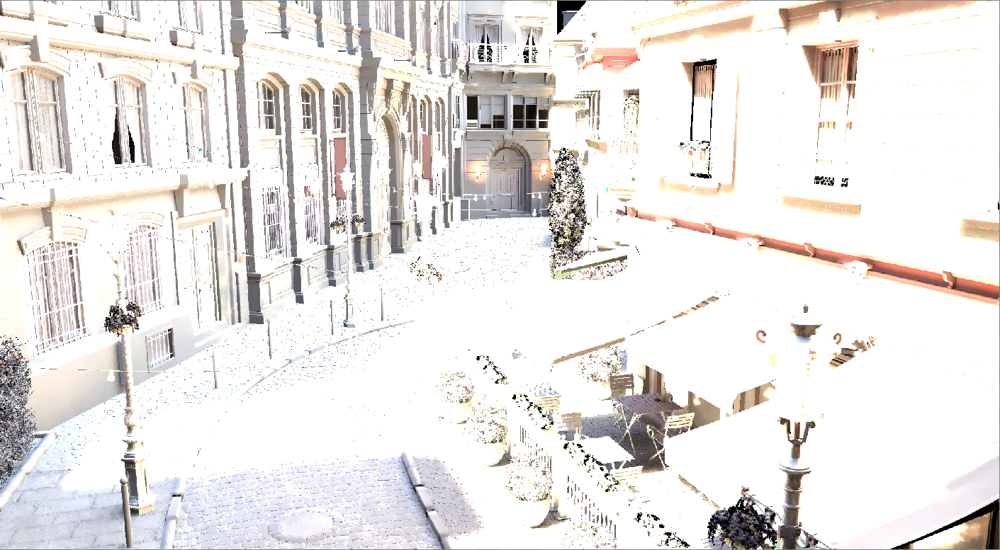
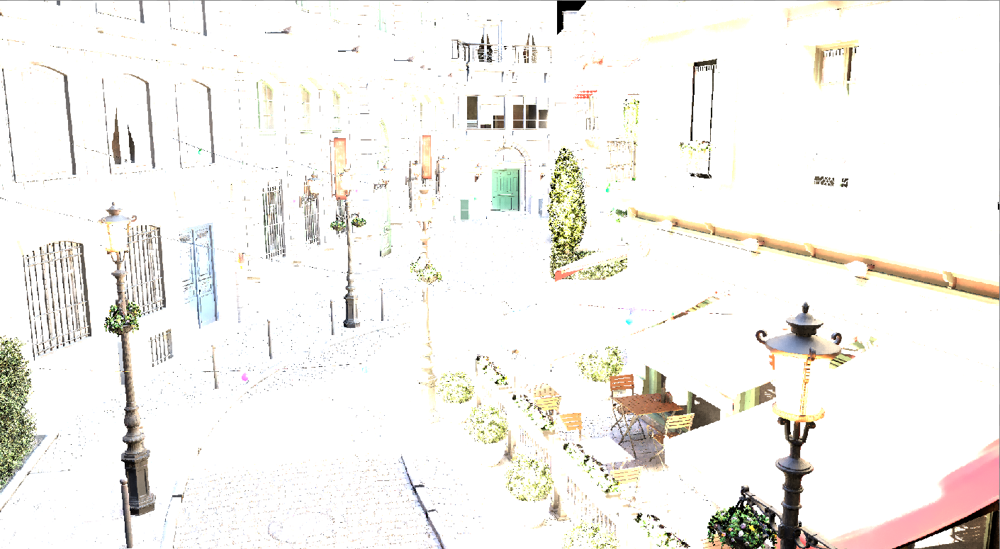
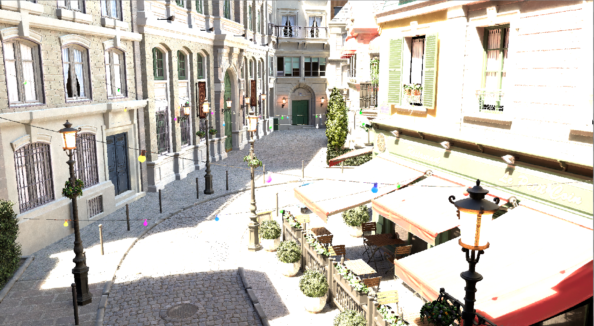
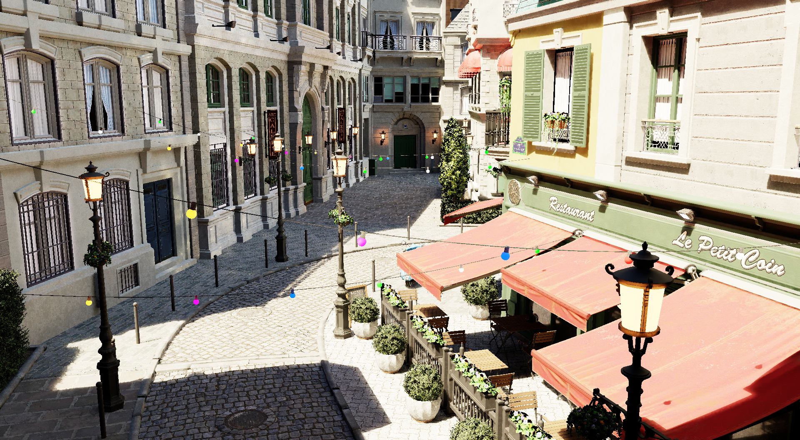

# Falcor ReSTIR GI Demo

---

- [Falcor ReSTIR GI Demo](#falcor-restir-gi-demo)
- [Abstract](#abstract)
- [Run the Demo](#run-the-demo)
  - [Download](#download)
  - [Run](#run)
    - [Keyboard Shortcuts](#keyboard-shortcuts)
    - [GUI parameters](#gui-parameters)
      - [ReSTIR DI/GI parameters](#restir-digi-parameters)
      - [Others](#others)
- [How to build](#how-to-build)
  - [Prerequisites](#prerequisites)
  - [Clone and build](#clone-and-build)
    - [Visual Studio](#visual-studio)
    - [Visual Studio Code](#visual-studio-code)
    - [Configure Presets](#configure-presets)
- [Graphics pipeline overview](#graphics-pipeline-overview)
  - [Graph Overview](#graph-overview)
  - [Resources detail and execution time](#resources-detail-and-execution-time)
    - [Gbuffer](#gbuffer)
    - [ReSTIR DI](#restir-di)
    - [ReSTIR GI](#restir-gi)
      - [Output](#output)
    - [NRD](#nrd)
    - [ModulateIllumination \& ToneMapper](#modulateillumination--tonemapper)

---

# Abstract
This branch of repository contains a demo of the ReSTIR DI/GI technique implemented in **[Falcor 6.0](https://research.nvidia.com/publication/2021-06_restir-gi-path-resampling-real-time-path-tracing)**.
This is **my personal project, UNOFFICIAL implementation**, and the code is **just for study purpose** and inperfect.

ReSTIR DI/GI technique enables to render high quality image of scenes with many light sources and indirect lighting using real-time raytracing with few rays at each pixel per frame.
 - Official ReSTIR GI project page: https://research.nvidia.com/publication/2021-06_restir-gi-path-resampling-real-time-path-tracing
 - Official ReSTIR DI project page: https://benedikt-bitterli.me/restir/

Also this demo use Nvidia Real-Time denoisers (NRD) to denoise the image which is included in Falcor.
 - Official NRD SDK page: https://developer.nvidia.com/rtx/ray-tracing/rt-denoisers
 - NRD Github page: https://github.com/NVIDIAGameWorks/RayTracingDenoiser

The implementation is in [`Source/RenderPasses/Falcor-playground`](https://github.com/udemegane/Falcor-playground), as 2 RenderPasses `ReSTIRDIPass` and `ReSTIRGIPass`.


**Details of implementation is described in [here](#graphics-pipeline-overview)**.


# Run the Demo
## Download
You can download the prebuild demo from [Releases](https://github.com/udemegane/Falcor/releases/tag/v0.1.0-restir_gi_demo).
And you can olso download 3D scenes form [ORCA](https://developer.nvidia.com/orca): A collection of scenes and assets optimized for Falcor.

## Run
Execute `Demo.bat`, then the renderer will launch.
If you build falcor manually, execute `Demo_vscode/vs2019/vs2022.bat` Instead of Demo.bat.

\
Click `File` -> `Load Scene`, then select a scene file.\
\

Then, you can see the real-time pathtrace demo.
\
For more information, please see Falcor original Page: https://github.com/NVIDIAGameWorks/Falcor

### Keyboard Shortcuts

`F1` - Show the help message\
`F2` - Show/Hide the GUI\
`F6` - Show/Hide the graph controls\
`F9` - Show/Hide the time controls\
`F10` - Show/Hide FPS\
`F11` - Show/Hide the menu bar\
`` ` `` - Show/Hide the scripting console\
`P` - Enable/Disable profiling\
`Esc` - Quit

`Ctrl + O` - Load script\
`Ctrl + Shift + O` - Load scene\
`F5` - Reload shaders\
`V` - Toggle VSync\
`F12` - Capture screenshot\
`Shift + F12` - Capture video\
`Pause` or `Space` - Pause/Resume the global timer\
`Ctrl + Pause` or `Ctrl + Space` - Pause/Resume the renderer

`W, A, S, D, Q, E` - Move the camera\
`Left Click + Drag` - Rotate camera\
`Shift` - Speeds up camera movement when held down\
`Ctrl` - Slows down camera movement when held down\
`Z` - Magnify the currently hovered area\
`Mouse Wheel` - Change zoom level when magnifying a pixel

You can see more information for handling Mogwai from [here](https://github.com/NVIDIAGameWorks/Falcor/tree/master/docs/tutorials).

### GUI parameters
#### ReSTIR DI/GI parameters

- `Enable ReSTIR` : Enable/Disable ReSTIR for direct illumination from scene analytic lights
- `Use Half Resolution` : Enable/Disable half resolution for Indirect Lighting
  - Note: This option is still incomplete, so it causes firefly noise in the image.
- `Secondary Ray Probability` : The probability of tracing secondary multi-bounce ray for Indirect Lighting.
- `Russian Roulette Probability` : The propablity of tracing multi-bounce ray for Indirect Lighting.
- `Use Multi Bounces` : Enable/Disable Multi bounces for Indirect Lighting. The number of bounces is limited by `Max Bounces` parameter.
- `Exclude EnvMap and Emissive mesh from RIS` : If this option is enabled, the ReSTIR algorithm uses only the scene analytic lights.
  - Note: Because the implementation is imperfect, resampling of emissive lights overestimates radiance. This option is On by default.
- `Temporal Resampling` : Enable/Disable Temporal Resampling for Indirect Lighting.
  - `Reservoir Size` : Max temporal reservoir size.
- `Spatial Resampling` : Enable/Disable Spatial Resampling for Indirect Lighting.
  - `Neighbors Count` : Number of neighbors for spatial resampling.
  - `Sample Radius` : Radius of spatial resampling.
  - `Reservoir Size` : Max spatial reservoir size.

#### Others
You can also change parameters other renderpasses, and scene settings such as lights, camera, etc.
\


# How to build
## Prerequisites
  - Windows 10 version 20H2 (October 2020 Update) or newer, OS build revision .789 or newer
  - Visual Studio 2019/2022
  - Windows 10 SDK (10.0.19041.0) for Windows 10, version 2004
  - A GPU which supports DirectX Raytracing, such as the NVIDIA Titan V or GeForce RTX
  - NVIDIA driver 466.11 or newer

This demo requires the Falcor framework. For more information, please follow the Falcor original Page: https://github.com/NVIDIAGameWorks/Falcor

## Clone and build

Clone this repository by specifying "ReSTIR_GI_Demo" branch with submodules.
```bash
git clone -b ReSTIR_GI_Demo https://github.com/udemegane/Falcor.git --recursive
```
Falcor uses the [CMake](https://cmake.org) build system. Additional information on how to use Falcor with CMake is available in the [CMake](docs/development/cmake.md) development documetation page.

### Visual Studio
If you are working with Visual Studio, you can setup a native Visual Studio solution by running `setup_vs2019.bat` (or `setup_vs2022.bat`, same process) after cloning this repository. The solution files are written to `build/windows-vs2019` and the binary output is located in `build/windows-vs2019/bin`.


### Visual Studio Code
If you are working with Visual Studio Code, run `setup.bat` after cloning this repository. This will setup a VS Code workspace in the `.vscode` folder with sensible defaults (only if `.vscode` does not exist yet). When opening the project folder in VS Code, it will prompt to install recommended extensions. We recommend you do, but at least make sure that _CMake Tools_ is installed. To build Falcor, you can select the configure preset by executing the _CMake: Select Configure Preset_ action (Ctrl+Shift+P). Choose the _Windows Ninja/MSVC_ preset (or one for a different rendering backend). Then simply hit _Build_ (or press F7) to build the project. The binary output is located in `build/windows-ninja-msvc/bin`.

Warning: Do not start VS Code from _Git Bash_, it will modify the `PATH` environment variable to an incompatible format, leading to issues with CMake.
Note: wip

### Configure Presets
Falcor uses _CMake Presets_ store in `CMakePresets.json` to provide a set of commonly used build configurations. You can get the full list of available configure presets running `cmake --list-presets`:

```
$ cmake --list-presets
Available configure presets:

  "windows-vs2019"           - Windows VS2019
  "windows-vs2022"           - Windows VS2022
  "windows-ninja-msvc"       - Windows Ninja/MSVC
  "linux-ninja-clang"        - Linux Ninja/Clang
```

Use `cmake --preset <preset name>` to generate the build tree for a given preset. The build tree is written to the `build/<preset name>` folder and the binary output files are in `build/<preset name>/bin`.

An existing build tree can be compiled using `cmake --build build/<preset name>`.

---
# Graphics pipeline overview
## Graph Overview
Render-Graph dependency of this demo is shown in below.\


The above diagram omits resources that are not actually used.
The actual dependencies are described in [the python script](https://github.com/udemegane/Falcor/blob/ReSTIR_GI_Demo/scripts/RealTimePathTrace.py).

## Resources detail and execution time

### Gbuffer
### ReSTIR DI



### ReSTIR GI
#### Output



")

")
")

")
")

### NRD


### ModulateIllumination & ToneMapper




